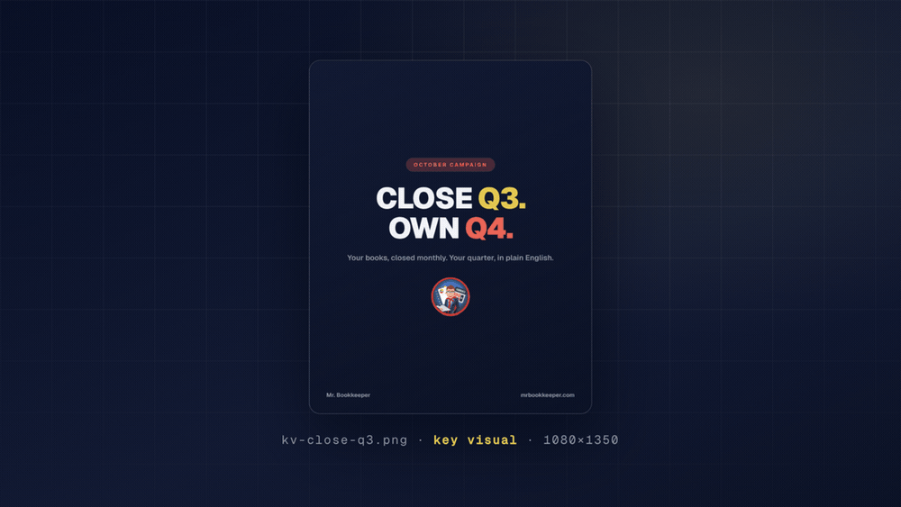
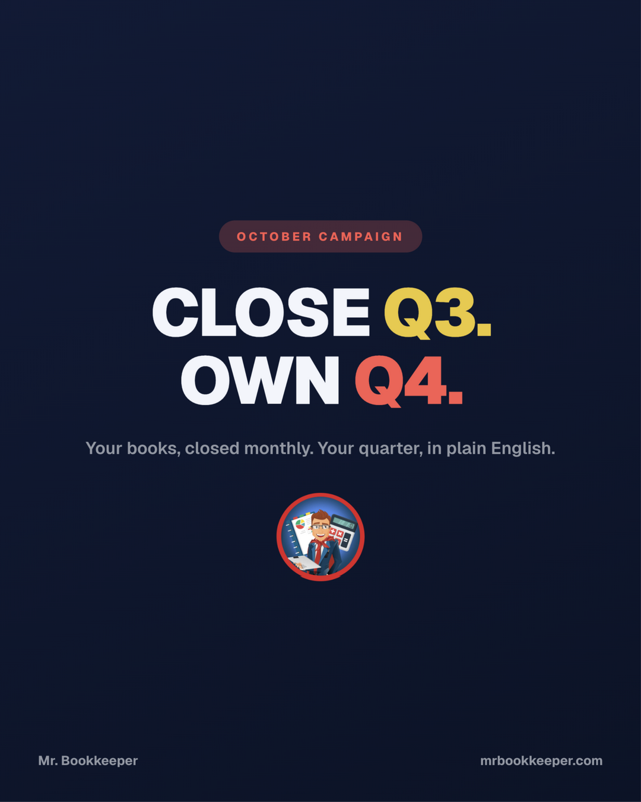
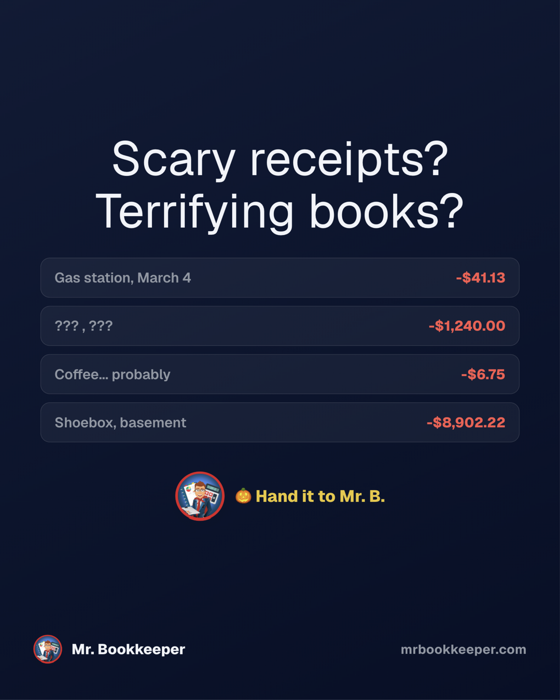
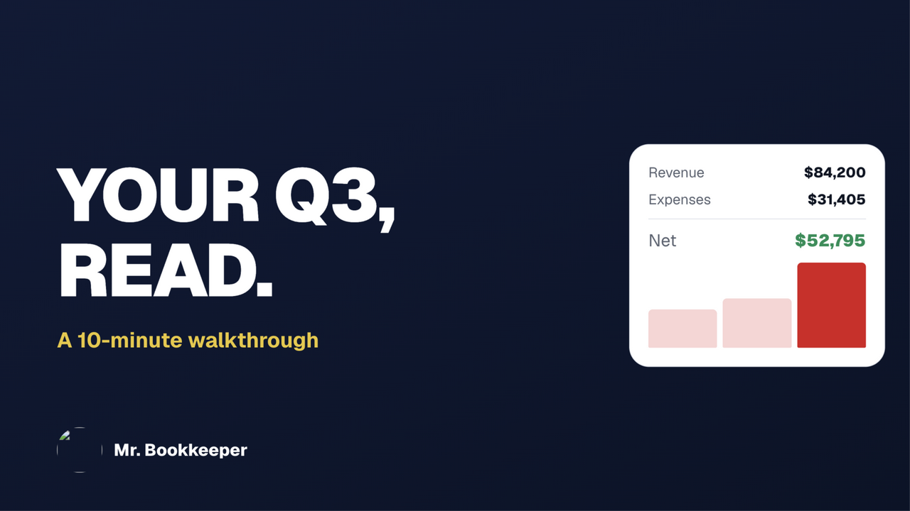
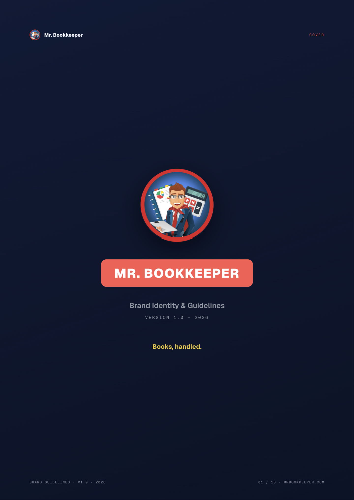

<div align="center">



# Marketing Studio

**An AI marketing team that ships real assets — then grades its own work before you see it.**

[](LICENSE)
[](#how-a-campaign-runs)
[](#the-judge-gate)


[Install](#install) · [The five skills](#the-five-skills) · [Onboard any app](#onboard-any-app-in-3-steps) · [Live docs](https://marketing-studio-basharlouzons-projects.vercel.app)

</div>

---

Most "AI marketing" tools write captions. This one **runs the whole production line** — strategy briefs, pixel-exact images, motion-designed videos, an 18-page brand book — and then a separate visual-judge pass grades every asset with evidence-based verdicts. Anything under the bar gets grouped by root cause, fixed, re-rendered, and re-judged. The gate is the product.

Everything above the fold of that GIF was produced by this repo: the terminal run is the actual orchestration flow, and every card shown was generated, judged, and shipped by it.

## What you get from one run

| | |
|---|---|
|  |  |
|  |  |

*Key visuals, calendar-moment stories, YouTube thumbnails, and an 18-page brand book — all from the October 2026 run. **31-day calendars** and **8 short-form scripts** come standard with every campaign.*

## Install

```bash
git clone https://github.com/Basharlouzon/marketing-studio.git
cd marketing-studio
./install.sh        # copies 5 skills into ~/.zcode/skills/
# restart your agent — done.
```

Works with **Claude Code**, **ZCode**, and any agent that loads `SKILL.md` skills.

## The five skills

| # | Skill | Owns |
|---|---|---|
| 0 | [`inspiration-intake`](skills/inspiration-intake/SKILL.md) | Asks you what you're looking for (goal / look / channels), researches current trends on the internet, writes the intake + inspiration docs — before any concept lock |
| 1 | [`brand-kit`](skills/mbk-brand-kit/SKILL.md) | The brand truth: exact color tokens, real product facts, voice + CTA conventions, layout laws. One file per product — clone it via the [template](templates/brand-kit-template/SKILL.md) |
| 2 | [`social-image-studio`](skills/social-image-studio/SKILL.md) | The image factory: payload-driven generators → pixel-exact posts, stories, thumbnails, PDF pages → judge QA. Bundled render + preverify scripts |
| 3 | [`marketing-agent-studio`](skills/marketing-agent-studio/SKILL.md) | The orchestration playbook: which expert agent to dispatch, in what order, with what brief. Copy-paste prompts in `references/` |
| 4 | [`remotion-motion-studio`](skills/remotion-motion-studio/SKILL.md) | Real motion videos (never static-slide zoompan): Motion Designer spec → Motion Animator implementation → render, in a Remotion project |

## How a campaign runs

```
inspiration-intake          ask the user + scan the internet for trends
 └─> concept lock           on real calendar moments (deadlines, quarters, seasons)
      ├─> agent waves       Campaign Director + Video Director + Content Writer
      ├─> image factory     posts, stories, thumbnails — 1080×1350 / 1080×1920 / 1280×720
      ├─> motion studio     Reels / TikToks / Shorts (Remotion, music bed)
      └─> judge gate        every asset gets a pass/fail verdict with evidence
                            fails are grouped by root cause → fixed → re-judged
```

Docs render the shipped SKILL.md files at build time — **they can't drift from the code**: [live docs](https://marketing-studio-basharlouzons-projects.vercel.app).

## Onboard any app in 3 steps

1. `cp -r templates/brand-kit-template skills/<app>-brand-kit/` and fill the placeholders — extract the app's exact colors from its CSS, its logo, its real facts (the template walks you through it).
2. Scaffold the workspace: `assets/` + `strategy/` + `images/` + one generator (clone patterns included).
3. Say "make 12 posts for {app} for December" — the studio asks what you're looking for, researches trends, builds, and judges.

## The judge gate

Every asset ships only after a stateless visual-judge pass returns `pass`/`fail` **with specific evidence** — truncated text, dead bands, broken assets, contrast failures. Fails are grouped by root cause (one CSS fix usually cures many), re-rendered, and re-judged. In the October run: **80+ assets, all judged**, across three fix waves.

## Provenance

Built and audited by AI agents. The production lineage: a Design Researcher brief, a 19-defect site audit, three fresh-agent simulations, a 13-agent review wave, and a final red-team sign-off (9/10) — plus the visual judges that gated every image and video shown here.

## Repository layout

```
skills/                          # the 5 skills (source of truth)
  <name>/SKILL.md                # frontmatter + body, loaded by the agent
  <name>/scripts/                # render_batch.mjs · preverify.py · extract_qa_frames.sh
  marketing-agent-studio/references/role-prompts.md   # 7 copy-paste agent briefs
  mbk-brand-kit/assets/          # tokens.json + tokens.css
templates/brand-kit-template/    # fill-in brand kit for any new app
docs-site/                       # static docs site (Vercel) + showcase assets
install.sh                       # idempotent installer → ~/.zcode/skills/
```

## Out of scope

Publishing/scheduling to platforms — this studio produces and QA's assets; posting is manual or a future skill.
